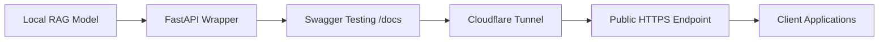

# CortexRAG - API Deployment & Integration Guide

This document outlines the step-by-step roadmap to wrap the **CortexRAG** model into a production-ready FastAPI service, run it locally, expose it publicly via Cloudflare Tunnel, and provide integration documentation for external developers.

---

## Workflow Overview



---

## Step-by-Step Implementation Roadmap

### Step 1: Model Code Verification & Preparation
- Verify model initialization, FAISS index loading, sentence-transformer embedding model, reranker, and LLM (e.g., Groq API / local LLM).
- Structure model code cleanly into a reusable class/module (e.g., `rag_pipeline.py`).

### Step 2: FastAPI Web Service (`app.py` / `main.py`)
- Create lightweight FastAPI application.
- Define request model (`QueryRequest`) and response model (`QueryResponse`).
- Define endpoint: `POST /query` (or `/predict`).
- Add lifecycle events (`lifespan` / `@app.on_event("startup")`) to load heavy ML/FAISS models once into memory on startup.

### Step 3: Local Testing via FastAPI Swagger UI
- Launch server locally:
  ```bash
  uvicorn app:app --reload --host 127.0.0.1 --port 8000
  ```
- Navigate to `http://127.0.0.1:8000/docs` to test input payload, validation, error handling, and JSON output structure.

### Step 4: Developer Manual Verification
- Execute tests using `curl`, Postman, or Python `requests` script to verify:
  - Valid queries return correct RAG answers and source documents.
  - Invalid inputs return standard `422 Unprocessable Entity` or structured error messages.

### Step 5: Public Exposure via Cloudflare Tunnel
- Install Cloudflare CLI (`cloudflared`).
- Run ad-hoc public tunnel:
  ```bash
  cloudflared tunnel --url http://127.0.0.1:8000
  ```
- Copy generated HTTPS URL (e.g., `https://your-tunnel-subdomain.trycloudflare.com`).

### Step 6: Public Endpoint Testing
- Validate public URL with live queries:
  ```bash
  curl -X POST "https://your-tunnel-subdomain.trycloudflare.com/query" \
       -H "Content-Type: application/json" \
       -d "{\"question\": \"What are the symptoms of acute hypertension?\", \"top_k\": 5}"
  ```

### Step 7: Developer Integration Specification
Provide client developers with exact details required for integration:

| Attribute | Value |
| :--- | :--- |
| **Base URL** | `https://<your-cloudflare-tunnel-url>` |
| **Endpoint** | `/query` |
| **HTTP Method** | `POST` |
| **Headers** | `Content-Type: application/json` |

#### Request Body (JSON)
```json
{
  "question": "What are the common side effects of Lisinopril?",
  "top_k": 6
}
```

#### Response Body (JSON)
```json
{
  "status": "success",
  "question": "What are the common side effects of Lisinopril?",
  "answer": "Common side effects include dizziness, cough, headache...",
  "sources": [
    {
      "id": 1024,
      "text": "Lisinopril documentation excerpt...",
      "score": 0.89
    }
  ],
  "execution_time_seconds": 0.42
}
```
